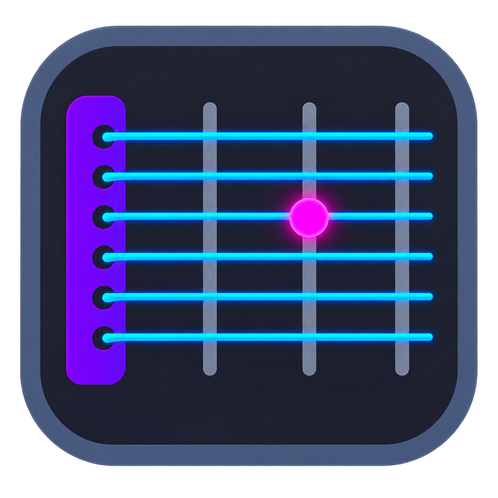

<div align="center">

# 🎸 FretViz




**An interactive fretboard visualizer that overlays live scale maps on your guitar tabs — watch the notes light up as they play.**

Built with Tauri (Rust) + React + TypeScript. Desktop-first, web-ready.

[](https://tauri.app)
[](https://react.dev)
[](https://www.typescriptlang.org)
[](#license)

</div>

---

## What is this?

FretViz plays your guitar tabs and shows you *where you are on the neck* while it does it — a moving cursor note tracked against a static scale-box overlay, the same visual language creators use in scale-practice videos, except it's software you actually own and can point at any tab.

Load a `.gp3/.gp4/.gp5/.gpx` file, or paste tab text and let it convert to alphaTex. Pick a scale. Hit play. The active note lights up pink in real time against orange root notes and blue scale tones, synced exactly to playback — not hand-keyframed in a video editor.


---

## Features (TO COME)

- 🎯 **Live scale overlay** — pick any key/scale, see root and scale-tone dots drawn across the whole neck, updated instantly
- 📍 **Real-time playback cursor** — the currently-sounding note(s) highlight in sync with playback, driven directly by the tab engine, not guessed from audio
- 🖱️ **Click-to-hear** — click any fret on the visual neck or any note in the tab to hear it in isolation
- ▶️ **Full transport controls** — play/pause, variable speed (0.25x–1.5x), tempo display, loop regions
- ✏️ **Built-in tab editor** — write and edit tabs directly using alphaTex, no external tools required
- 💾 **Personal tab library** — save every tab you've imported or written, searchable, stored locally
- 📥 **Flexible import** — load `.gp` files directly, or paste ASCII tab text (UG-style) for conversion
- 🖥️ **Desktop-first, web-ready** — same codebase runs as a native Tauri app now, deployable to the browser later with no rewrite

---

## Quick Start

downloadable .exe TO COME

### 1. Prerequisites

| Tool | Why |
|---|---|
| [Rust](https://rustup.rs/) (stable) | Powers the Tauri shell |
| [Bun](https://bun.sh) | Package manager + runner |
| OS-specific Tauri deps | See below |

<details>
<summary><b>macOS</b></summary>

```bash
xcode-select --install
```
</details>

<details>
<summary><b>Windows</b></summary>

Install the **Microsoft C++ Build Tools** and **WebView2 Runtime** (WebView2 ships with Win10/11 by default).
</details>

<details>
<summary><b>Linux</b></summary>

```bash
sudo apt install libwebkit2gtk-4.0-dev build-essential curl libssl-dev \
  libgtk-3-dev libayatana-appindicator3-dev librsvg2-dev
```
</details>

### 2. Clone & run

```bash
git clone https://github.com/yourname/fretviz.git
cd fretviz
bun install
bun run tauri dev      # hot-reload dev mode
```

### 3. Build a release binary

```bash
bun run tauri build
```
Output lands in `src-tauri/target/release/bundle/`.

---


## Tech Stack

| Layer | Choice | Why |
|---|---|---|
| Shell | [Tauri](https://tauri.app) | Native desktop binary, small footprint, ships to web later with no rewrite |
| Frontend | React + TypeScript | Fast iteration, type safety across tab/scale/note data shapes |
| Tab engine | [alphaTab](https://alphatab.net) | Parses `.gp3`–`.gpx`, alphaTex, and MusicXML; handles MIDI synthesis and playback timing out of the box |
| Music theory | [tonal.js](https://github.com/tonaljs/tonal) | Scale/key computation, note math |
| State | [Zustand](https://github.com/pmndrs/zustand) | Lightweight store for high-frequency playback position updates |
| Storage | [Dexie.js](https://dexie.org) | Typed IndexedDB wrapper — identical API on desktop (Tauri webview) and web |

---

## Roadmap

- [ ] AlphaTab playback with real-time active-note tracking
- [ ] SVG fretboard with static scale overlay
- [ ] Click-to-hear individual notes
- [ ] Tab library (save/search/delete via Dexie)
- [ ] alphaTex-based in-app tab editor
- [ ] ASCII tab paste → alphaTex conversion
- [ ] Loop regions + tempo control UI
- [ ] Web deployment (Cloudflare Pages)
- [ ] Optional cloud sync across devices (Supabase)

---

## License

MIT

